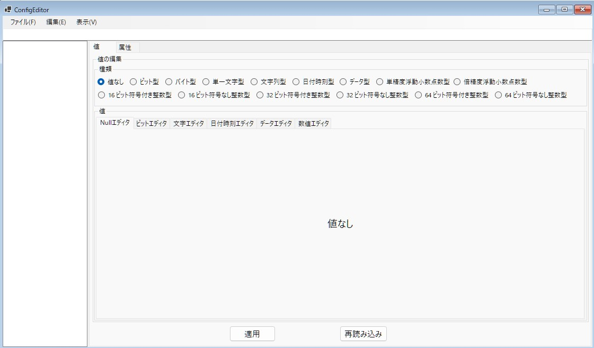

# WSOFTConfig( [English](README.md) / Japanese )

## 概要
.NETから簡単に利用できる設定ファイル(*.wsconf)を読み書きするためのライブラリです。

.NETの基本的なデータ型に対応しつつ、XMLのような階層構造を持つことを目標としています。

既存の設定ファイルに対して、以下のようなアドバンテージがあります。
* 設定ファイルの圧縮が可能
* 設定ファイルのパスワードによる暗号化が可能
* **パス**により目的の値を簡単に表すことが可能
* バイナリファイルで書き出されることにより簡単な難読化が可能
* 設定中の値にいくつでも属性を付与することが可能
* 多機能エディタを公式が開発
* ほかのライブラリに依存せず、異なる言語への移植も容易

## 使い方
設定ファイルを編集するには、WSOFTConfig.UI.Testを使用します。

C#での簡単な使い方を以下に示します。
```csharp
using WSOFT.Config;

namespace WSOFTConfig.Sample
{
    internal static class Program
    {
        public static void Main()
        {
            //設定ファイルをローカルファイルから読み込み
            var config = ConfigFile.FromFile(path);

            //設定ファイルのルートにSampleという名前の値を書き込み
            config.Write("Sample",value);

            //Sampleという名前の値を読み込み
            config.Read("Sample");

            //Sampleという名前のキーを取得
            var sample = config.GetConfig("Sample");

            //Sampleの値はconfig.Readの結果と同じ
            sample.Value;

            //新しいキーを手動で生成
            var sample2 = new ConfigModel(value2);

            //Sampleの子要素にする
            sample.Children.Add(sample2);

            //Sample2の値を取得
            config.Read("Sample/Sample2");

            //パスの区切り文字は任意に設定可能
            config.Read("Sample\\Sample2",'\\');

            //設定ファイルを暗号化する
            config.Password = password;

            //設定ファイルを圧縮する
            config.IsCompressed = true;

            //設定ファイルをローカルファイルに書き出す
            config.SaveAsFile(path);
        }
    }
}

```

## 制限事項
### データサイズの制限
MicrosoftCLRの制限により、それぞれの値と全体のファイルのいずれでもデータサイズは、```Int32.MaxValue```を超えることができません。

これにより、合計でおよそ2GB以上のデータを保存することはできません。

### 使用できるデータ型の種類
WSOFTConfigは次のデータの読み込みと書き込みをサポートします。
|型の名前|概要|
:---:|:---
|None|空の値|
|Boolean|ビット型|
|Char|文字型|
|String|文字列型|
|Double|倍精度浮動小数点型|
|Single|単精度浮動小数点型|
|Int16|16ビット整数型|
|UInt16|16ビット自然数型|
|Int32|32ビット整数型|
|UInt32|32ビット自然数型|
|Int64|64ビット整数型|
|UInt64|64ビット自然数型|
|Data|バイナリ型|
|DateTime|日付時刻型|

## ライセンス
WSOFTConfig is under the [MIT license](LICENCE.md).