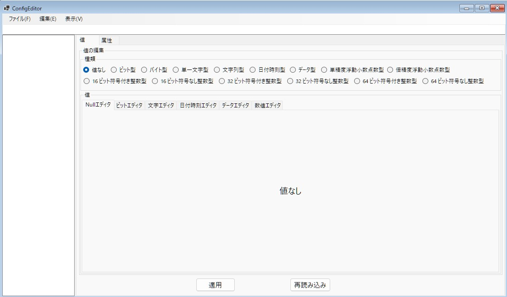

# WSOFTConfig( English / [Japanese](README-ja.md) )

## Overview
This is a library for reading and writing configuration files (*.wsconf) that are easily available from the dotnet.

The goal is to have an XML-like hierarchical structure while supporting the basic data types of dotnet.

The following advantages over existing configuration files are available
* Configuration files can be compressed
* Password encryption of configuration files is possible
* The desired value can be expressed as a path
* Exported as a binary file for easy obfuscation
* Any number of attributes can be added to the value
* Official development of a multifunctional editor
* No dependence on other libraries, easy to port to different languages

## How to use
To edit the configuration file, use WSOFTConfig.UI.Test

A simple usage in C# is shown below.
```csharp
using WSOFT.Config;

namespace WSOFTConfig.Sample
{
    internal static class Program
    {
        public static void Main()
        {
            //Load configuration files from local files
            var config = ConfigFile.FromFile(path);

            //Write a value named Sample in the root of the configuration file
            config.Write("Sample",value);

            //Load a value named Sample
            config.Read("Sample");

            //Get a key named Sample
            var sample = config.GetConfig("Sample");

            //Sample values are the same as config.Read results
            sample.Value;

            //Manually generate a new key
            var sample2 = new ConfigModel(value2);

            //Make it a child element of Sample
            sample.Children.Add(sample2);

            //Get the value of Sample2
            config.Read("Sample/Sample2");

            //Path delimiter can be set arbitrarily
            config.Read("Sample\\Sample2",'\\');

            //Encrypt configuration files
            config.Password = password;

            //Compress configuration files
            config.IsCompressed = true;

            //Save the configuration file to a local file
            config.SaveAsFile(path);
        }
    }
}

```

## Restrictions
### Data Size Limitations
Due to MicrosoftCLR limitations, the data size for both the individual values and the entire file cannot exceed ```Int32.MaxValue```.

This means that no more than approximately 2 GB of data can be stored in total.

### Available data types
WSOFTConfig supports reading and writing the following data.
|Type|Description|
:---:|:---
|None|null value|
|Boolean|bit type|
|Char|character type|
|String|character string type|
|Double|double precision floating point type|
|Single|single precision floating point type|
|Int16|16-bit integer type|
|UInt16|16-bit natural number type|
|Int32|32-bit integer type|
|UInt32|32-bit natural number type|
|Int64|64-bit integer type|
|UInt64|64-bit natural number type|
|Data|binary type|
|DateTime|date-time type|

## Licence
WSOFTConfig is under the [MIT license](LICENCE.md).